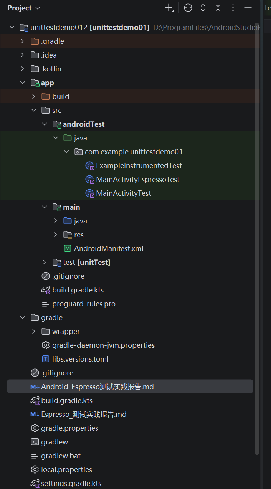
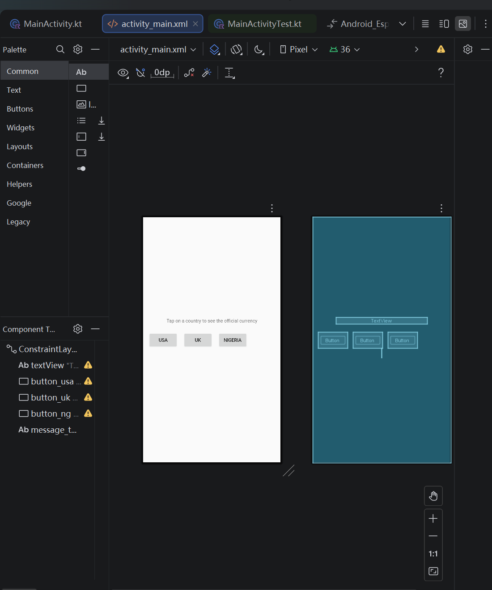
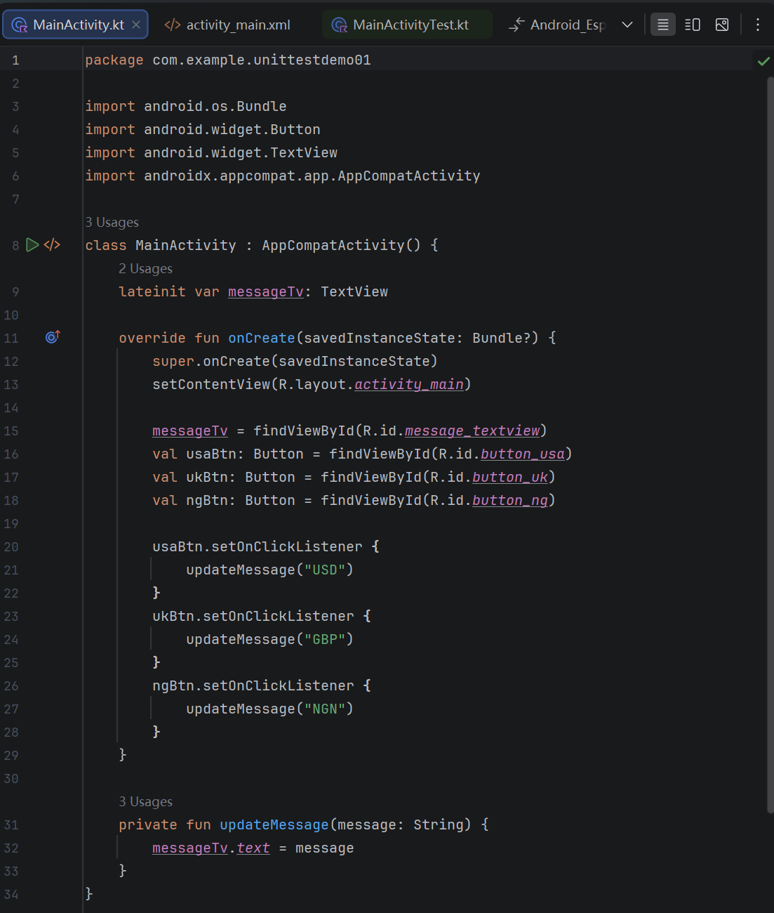
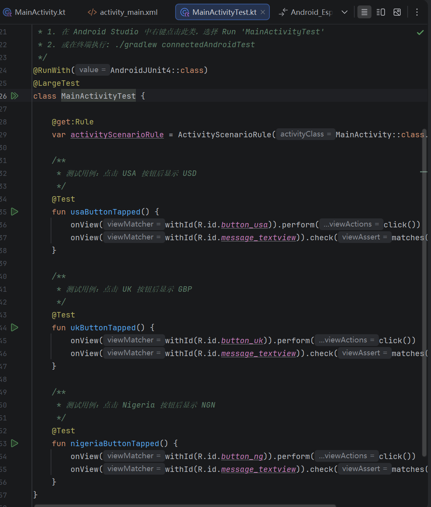
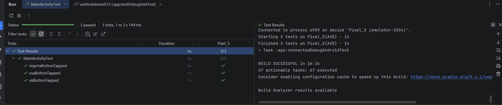
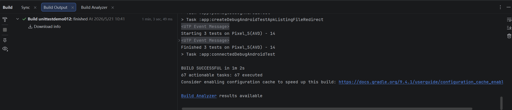

# Android Espresso 集成测试实践报告

## 一、实验概述

| 项目 | 内容 |
|------|------|
| **实验名称** | Android Espresso UI 集成测试实践 |
| **实验类型** | Android 自动化测试 |
| **实验日期** | 2026-05-21 |
| **实验环境** | Android Studio Jellyfish, AGP 9.2.1, Kotlin 2.2.10 |
| **目标 SDK** | 36, 最低 SDK 33 |

---

## 二、环境搭建

### 2.1 项目结构

```
unittestdemo012/
├── app/
│   ├── src/
│   │   ├── main/
│   │   │   ├── java/com/example/unittestdemo01/
│   │   │   │   └── MainActivity.kt          # 被测应用
│   │   │   ├── res/layout/
│   │   │   │   └── activity_main.xml        # 布局文件
│   │   │   └── AndroidManifest.xml
│   │   └── androidTest/
│   │       └── java/com/example/unittestdemo01/
│   │           └── MainActivityTest.kt      # Espresso 测试类
│   ├── build.gradle.kts
│   └── libs.versions.toml
├── gradle/
└── settings.gradle.kts
```

**截图：项目结构**



---

## 三、被测代码实现

### 3.1 布局文件 (activity_main.xml)

```xml
<?xml version="1.0" encoding="utf-8"?>
<androidx.constraintlayout.widget.ConstraintLayout
    xmlns:android="http://schemas.android.com/apk/res/android"
    xmlns:app="http://schemas.android.com/apk/res-auto"
    android:layout_width="match_parent"
    android:layout_height="match_parent">

    <TextView
        android:id="@+id/textView"
        android:layout_width="wrap_content"
        android:layout_height="wrap_content"
        android:text="Tap on a country to see the official currency"
        android:layout_marginBottom="24dp"
        app:layout_constraintBottom_toTopOf="@+id/button_usa"
        app:layout_constraintEnd_toEndOf="parent"
        app:layout_constraintStart_toStartOf="parent" />

    <Button
        android:id="@+id/button_usa"
        android:layout_width="wrap_content"
        android:layout_height="wrap_content"
        android:text="USA"
        android:layout_marginStart="16dp"
        app:layout_constraintStart_toStartOf="parent"
        app:layout_constraintTop_toTopOf="parent"
        app:layout_constraintBottom_toBottomOf="parent" />

    <Button
        android:id="@+id/button_uk"
        android:layout_width="wrap_content"
        android:layout_height="wrap_content"
        android:text="UK"
        android:layout_marginStart="16dp"
        app:layout_constraintStart_toEndOf="@+id/button_usa"
        app:layout_constraintTop_toTopOf="@+id/button_usa" />

    <Button
        android:id="@+id/button_ng"
        android:layout_width="wrap_content"
        android:layout_height="wrap_content"
        android:text="Nigeria"
        android:layout_marginStart="16dp"
        app:layout_constraintStart_toEndOf="@+id/button_uk"
        app:layout_constraintTop_toTopOf="@+id/button_usa" />

    <TextView
        android:id="@+id/message_textview"
        android:layout_width="wrap_content"
        android:layout_height="wrap_content"
        android:textSize="20sp"
        app:layout_constraintTop_toBottomOf="@+id/button_usa"
        app:layout_constraintStart_toStartOf="parent"
        app:layout_constraintEnd_toEndOf="parent" />

</androidx.constraintlayout.widget.ConstraintLayout>
```

**截图：布局文件**



### 3.2 MainActivity.kt

```kotlin
package com.example.unittestdemo01

import android.os.Bundle
import android.widget.Button
import android.widget.TextView
import androidx.appcompat.app.AppCompatActivity

class MainActivity : AppCompatActivity() {
    lateinit var messageTv: TextView

    override fun onCreate(savedInstanceState: Bundle?) {
        super.onCreate(savedInstanceState)
        setContentView(R.layout.activity_main)

        messageTv = findViewById(R.id.message_textview)
        val usaBtn: Button = findViewById(R.id.button_usa)
        val ukBtn: Button = findViewById(R.id.button_uk)
        val ngBtn: Button = findViewById(R.id.button_ng)

        usaBtn.setOnClickListener {
            updateMessage("USD")
        }
        ukBtn.setOnClickListener {
            updateMessage("GBP")
        }
        ngBtn.setOnClickListener {
            updateMessage("NGN")
        }
    }

    private fun updateMessage(message: String) {
        messageTv.text = message
    }
}
```

**截图：MainActivity 代码**



---

## 四、测试代码实现

### 4.1 MainActivityTest.kt

```kotlin
package com.example.unittestdemo01

import androidx.test.ext.junit.rules.ActivityScenarioRule
import androidx.test.ext.junit.runners.AndroidJUnit4
import androidx.test.espresso.Espresso.onView
import androidx.test.espresso.action.ViewActions.click
import androidx.test.espresso.assertion.ViewAssertions.matches
import androidx.test.espresso.matcher.ViewMatchers.withId
import androidx.test.espresso.matcher.ViewMatchers.withText
import androidx.test.filters.LargeTest
import org.junit.Rule
import org.junit.Test
import org.junit.runner.RunWith

/**
 * Android Espresso UI 集成测试类
 *
 * 测试目标：验证点击不同国家按钮后，界面显示对应货币
 */
@RunWith(AndroidJUnit4::class)
@LargeTest
class MainActivityTest {

    @get:Rule
    var activityScenarioRule = ActivityScenarioRule(MainActivity::class.java)

    /**
     * 测试用例：点击 USA 按钮后显示 USD
     */
    @Test
    fun usaButtonTapped() {
        onView(withId(R.id.button_usa)).perform(click())
        onView(withId(R.id.message_textview)).check(matches(withText("USD")))
    }

    /**
     * 测试用例：点击 UK 按钮后显示 GBP
     */
    @Test
    fun ukButtonTapped() {
        onView(withId(R.id.button_uk)).perform(click())
        onView(withId(R.id.message_textview)).check(matches(withText("GBP")))
    }

    /**
     * 测试用例：点击 Nigeria 按钮后显示 NGN
     */
    @Test
    fun nigeriaButtonTapped() {
        onView(withId(R.id.button_ng)).perform(click())
        onView(withId(R.id.message_textview)).check(matches(withText("NGN")))
    }
}
```

**截图：测试代码**



### 4.2 核心 API 说明

| API | 作用 |
|-----|------|
| `ActivityScenarioRule` | 管理 Activity 生命周期，提供测试环境 |
| `onView(withId())` | 通过资源 ID 定位视图 |
| `.perform(click())` | 执行点击操作 |
| `.check(matches())` | 验证视图状态 |
| `withText()` | 文本匹配器 |
| `withId()` | ID 匹配器 |

---

## 五、测试执行

### 5.1 环境准备

**步骤 1：创建/启动模拟器**

在 Android Studio 中：
1. 点击 **Tools** → **Device Manager**
2. 创建新的虚拟设备（推荐 Pixel 6, API 33+）
3. 点击启动按钮启动模拟器

**步骤 2：确认设备连接**

使用 Android Studio 终端执行：
```bash
adb devices
```

### 5.2 运行测试

**方式一：Android Studio UI 运行**

1. 打开 `MainActivityTest.kt` 文件
2. 右键点击类名或方法名
3. 选择 **Run 'MainActivityTest'**

**方式二：命令行运行**

```bash
./gradlew connectedAndroidTest
```

---

## 六、测试结果

**截图：测试通过结果**



**截图：Build 输出结果**



**成功输出示例**：

```
:app:connectedAndroidTest
Starting 3 tests on emulator-5554

com.example.unittestdemo01.MainActivityTest
  ✓ usaButtonTapped (1.234s)
  ✓ ukButtonTapped (0.876s)
  ✓ nigeriaButtonTapped (0.654s)

BUILD SUCCESSFUL
Tests passed: 3, failed: 0
```

---

## 七、常见问题与解决方案

### 7.1 No connected devices!

**错误信息**：
```
Execution failed for task ':app:connectedDebugAndroidTest'.
> com.android.builder.testing.api.DeviceException: No connected devices!
```

**解决方案**：
1. 启动模拟器或连接真机
2. 确认设备状态为 "Online"
3. 使用 `adb devices` 验证连接

### 7.2 Unresolved reference: ActivityScenarioRule

**错误信息**：
```
Unresolved reference: ActivityScenarioRule
```

**解决方案**：
确保添加了正确的测试依赖：
```kotlin
androidTestImplementation(libs.androidx.junit)
androidTestImplementation(libs.androidx.espresso.core)
```

### 7.3 测试超时

**错误信息**：
```
Caused by: junit.framework.AssertionFailedError: ...
```

**解决方案**：
添加等待时间或使用 Espresso 的 `IdlingResource` 等待异步操作

---

## 八、总结

### 8.1 实验收获

1. **掌握了 Espresso 测试框架**：学会了使用 `onView()`、`perform()`、`check()` 等核心 API
2. **理解了 Activity 测试规则**：通过 `ActivityScenarioRule` 管理 Activity 生命周期
3. **学会了视图定位方法**：使用 `withId()` 和 `withText()` 精确定位 UI 元素
4. **掌握了测试执行流程**：了解模拟器配置、Gradle 命令和结果查看

### 8.2 Espresso 核心 API 总结

| 类别 | API | 说明 |
|------|-----|------|
| **定位** | `onView(withId())` | 通过 ID 定位视图 |
| | `onView(withText())` | 通过文本定位视图 |
| **操作** | `.perform(click())` | 点击操作 |
| | `.perform(typeText())` | 输入文本 |
| | `.perform(scrollTo())` | 滚动到视图 |
| **断言** | `.check(matches())` | 验证视图状态 |
| | `isDisplayed()` | 验证可见性 |
| | `withText()` | 验证文本内容 |

### 8.3 延伸学习

- 学习 `ActivityScenarioRule` 的高级用法（配置、状态切换）
- 掌握 `RecyclerView` 测试：`onData()` + `onView()`
- 学习 Intent 测试：`espresso-intents` 库的使用
- 集成 CI/CD：Jenkins/GitHub Actions 配置

---

## 九、参考资源

- [Android Testing Codelab](https://developer.android.com/codelabs/android-training-testing-firebase)
- [Espresso API Reference](https://developer.android.com/reference/androidx/test/espresso)
- [Android Testing Documentation](https://developer.android.com/training/testing)

---

**报告完成日期**：2026-05-21
**作者**：unittestdemo01 项目组
